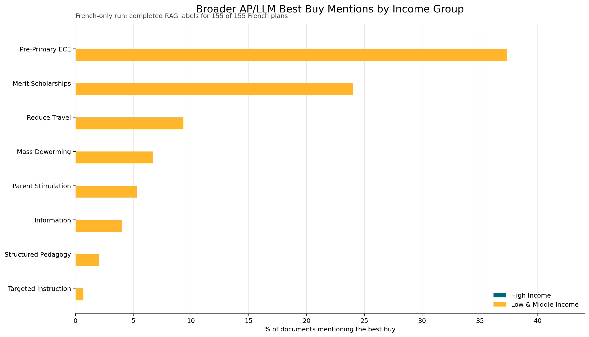
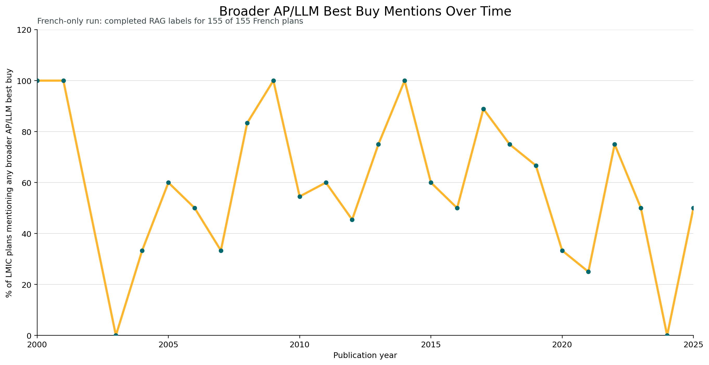
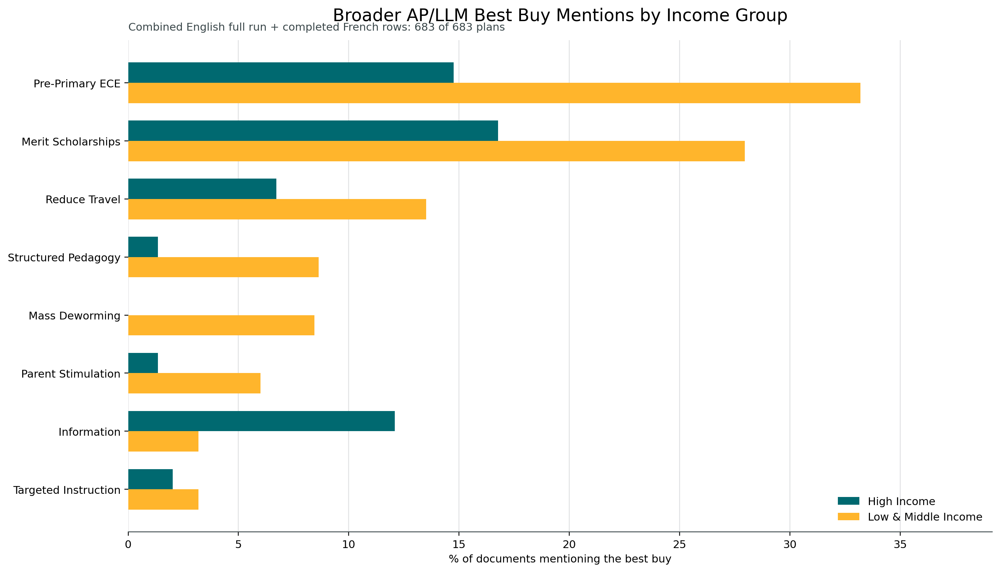
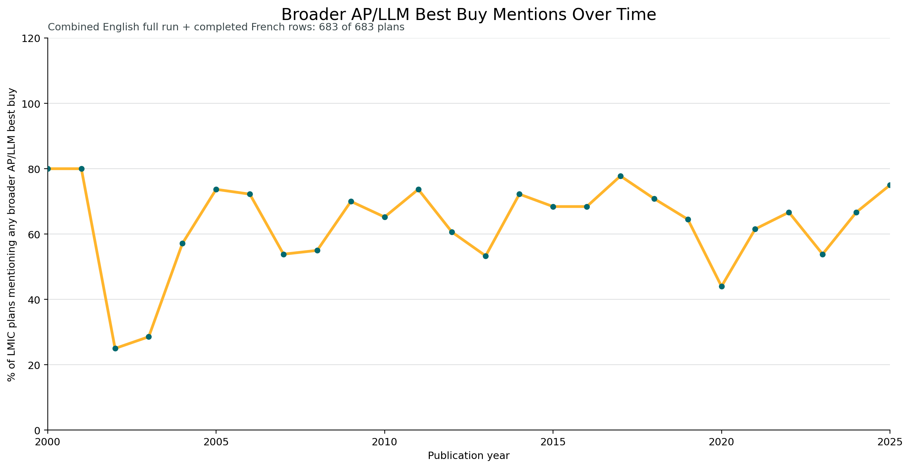

# Government Plans Smart Buys: French Extension

These figures mirror the broad AP/LLM charts in the main post, but extend them with the French-language run.

The French broad-search run is now complete. The file output/nep_counted_llm_rag_french_full_v1.dta contains completed labels for all `155` plans in the no-English-counterpart French sample. The combined charts therefore use the full English run (`528` plans) plus the full French run (`155` plans), for a bilingual broad-search sample of `683` plans across `120` countries.

## French Only

**Broader AP/LLM smart buy mentions by income group, French plans only.** This uses the completed no-English-counterpart French sample.

**Broader AP/LLM smart buy mentions over time, low- and middle-income countries only, French plans only.** This mirrors the main blog’s broader time-series chart, but is limited to the French sample.

## English Plus French

**Broader AP/LLM smart buy mentions by income group, English plus French combined.** This adds the full French run to the existing English full-corpus broad search.

**Broader AP/LLM smart buy mentions over time, low- and middle-income countries only, English plus French combined.** This is a bilingual version of the main blog chart.

