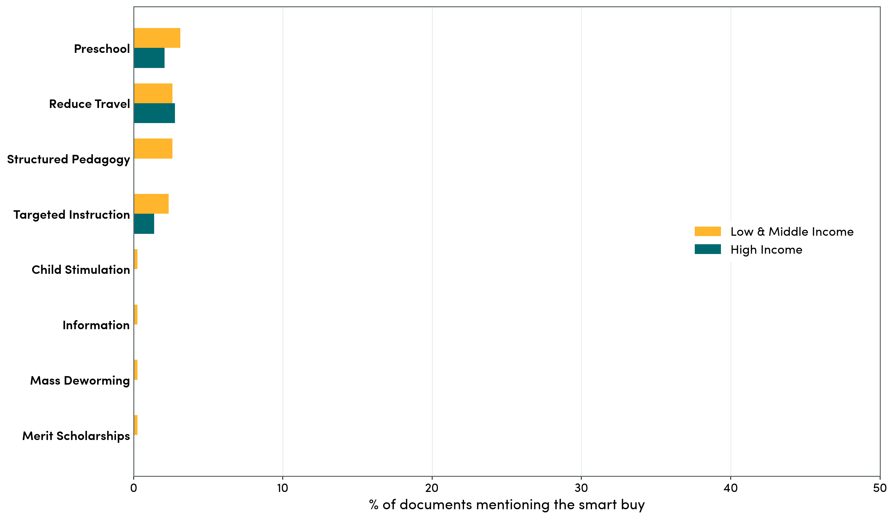
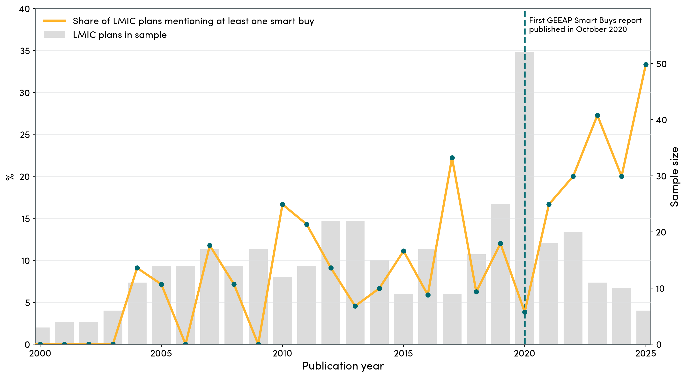
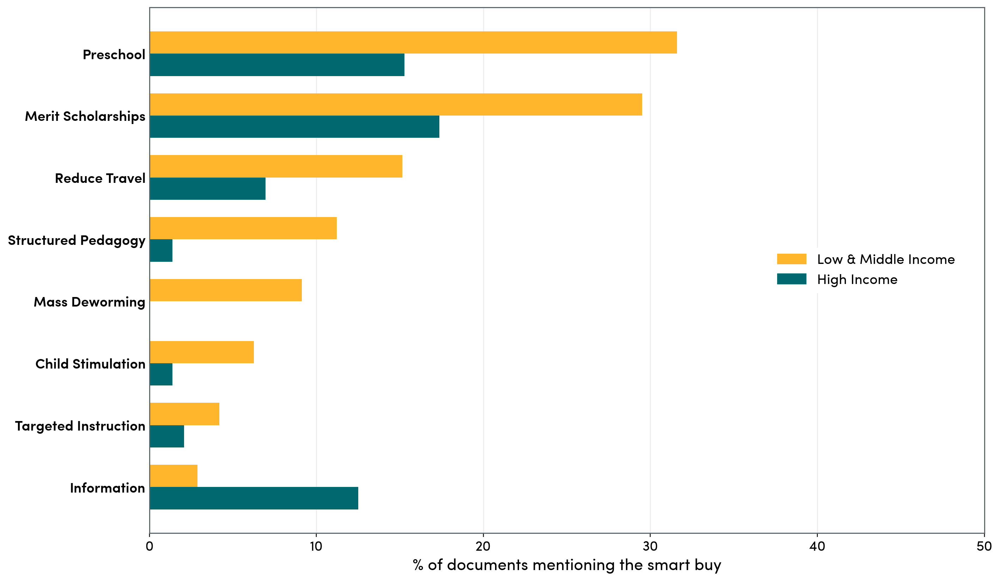
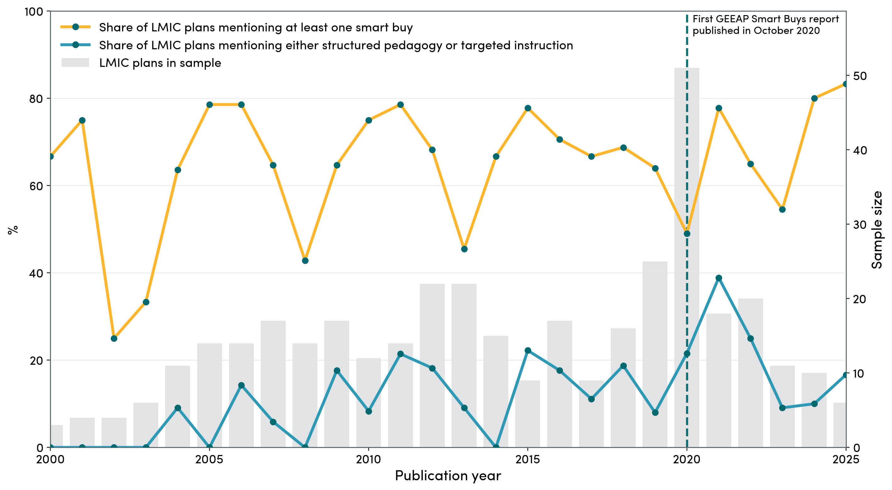
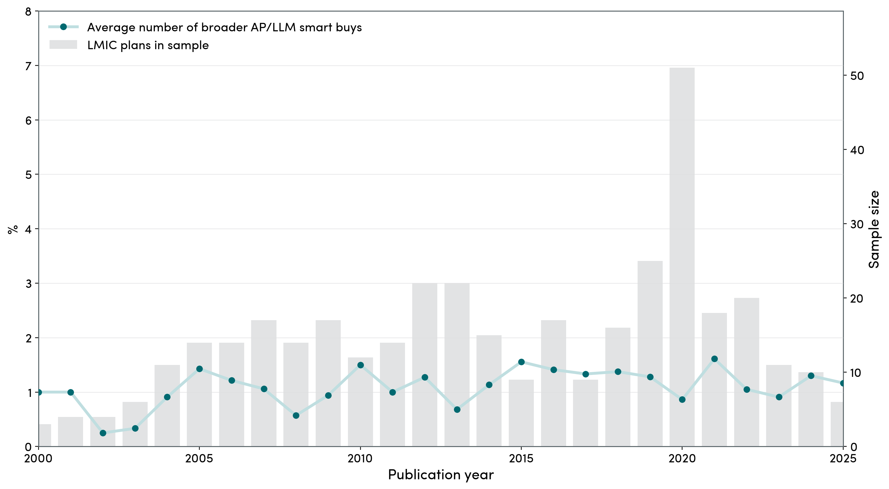
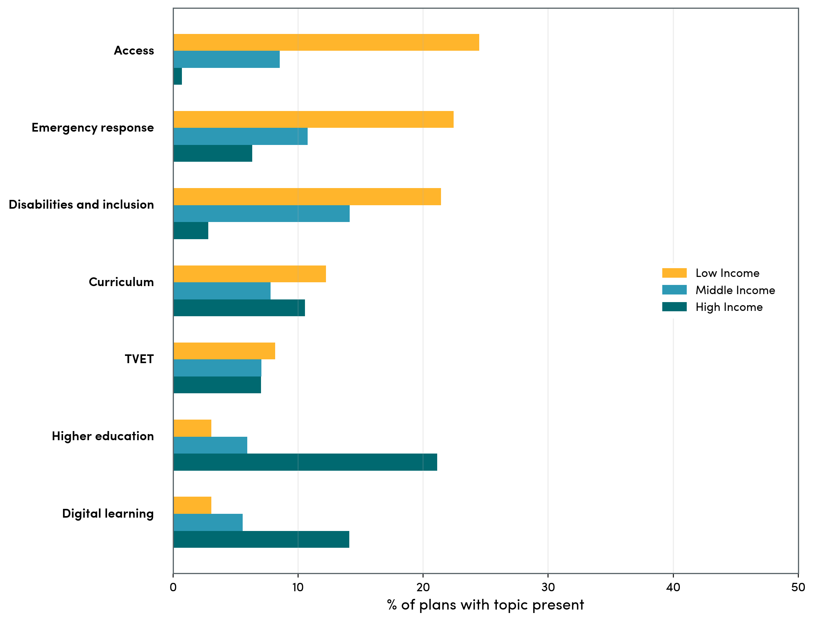
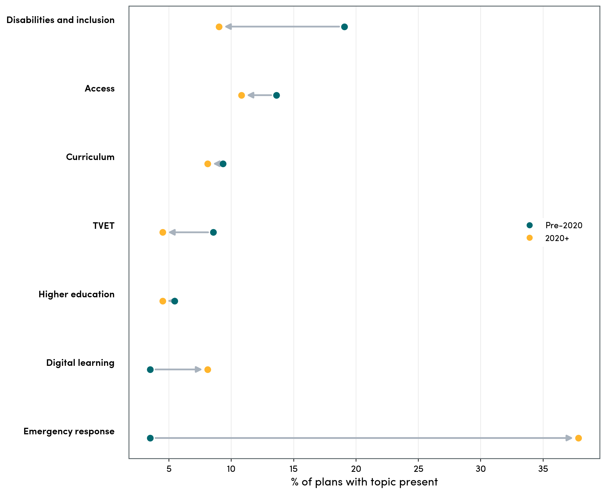
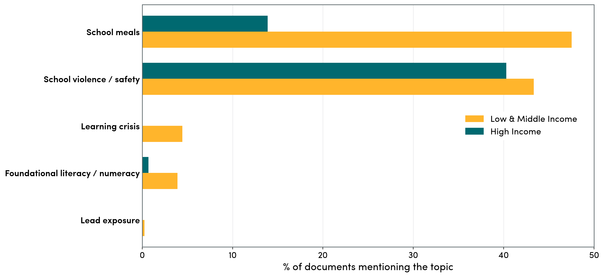
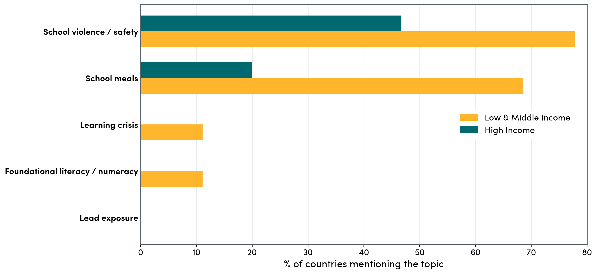
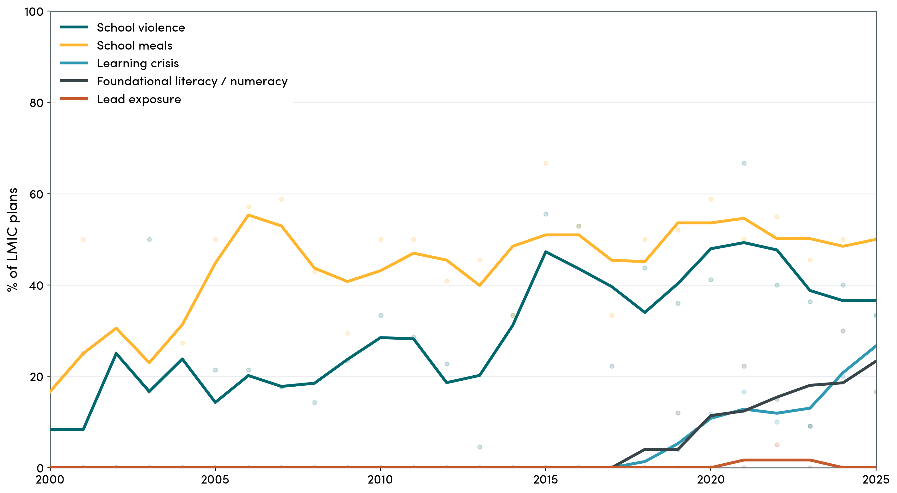

# Are Developing Countries Planning To Do What Works In Education?

In a recent blog we looked at whether two major donors, FCDO and the World Bank, mention education "smart buys" in their project documents. The next question is what recipient governments themselves are planning to do.

For this pass, we scraped UNESCO Planipolis, starting from `1,618` document URLs, downloading `1,008` PDFs, and then narrowing the text-analysis sample to `528` English or English-accessible plans from `101` countries. The plans span roughly three decades of education planning.

We then searched those plans for the eight education smart buys highlighted by the Global Education Evidence Advisory Panel: structured pedagogy, targeted instruction, information on the benefits of schooling, parent stimulation, preschool, reducing travel time, merit scholarships, and mass deworming. We do this in two layers: a strict reviewed phrase search, and then a broader retrieval-augmented generation (RAG) pass that tries to capture the same intervention ideas even when plans do not use the canonical labels.

> **Main takeaway**
>
> The strict search gives a conservative lower bound of explicit smart-buy references. The broader AP/LLM layer picks up more plans that appear to be using the same ideas. But when we step back from smart buys entirely, the wider corpus suggests governments are more often focused on inclusion, access, higher education, and emergency response than on naming these learning reforms directly.

## A Strict Lower Bound

We start with the narrowest screen: a reviewed phrase-based search intended to capture only relatively explicit smart-buy mentions.

**Strict smart buy mentions by income group.** This reviewed phrase search is the conservative lower-bound figure.

This is best read as a lower bound. It tells us where plans are relatively direct about these intervention ideas.

## Are These Strict Mentions All Recent?

To put the strict screen in time perspective, the figure below shows the share of LMIC plans mentioning at least one strict smart buy by publication year. The pattern is noisy, but it shows that these mentions are not only a post-2020 phenomenon.

**Smart buy mentions over time.** Share of LMIC plans mentioning at least one smart buy by publication year.

## A Broader Read Of The Same Ideas

But we wanted to look at more than just perfect references. The broader AP/LLM search is meant to capture cases where a plan may not literally say "structured pedagogy" or "teaching at the right level", but is still clearly describing the same underlying concept.

We interpret this broader layer as a sign that governments are using these ideas, even when the language is looser or more context-specific.

**Broader AP/LLM smart buy mentions by income group.** This is the broader layer using the completed full-corpus RAG run across all `528` plans.

At the aggregate level, the broader search changes the level of mentions more than it changes the overall pattern. In other words, it finds more plausible smart-buy-equivalent language, but it does not overturn the broad story.

**Broader AP/LLM smart buy mentions over time, low- and middle-income countries combined.** The gold line shows the share of LMIC plans mentioning at least one broader smart buy. The blue line isolates just the two learning-reform ideas we care about most — structured pedagogy or targeted instruction. Annual sample bars are shown in the background.

One useful alternative to the simple “at least one smart buy” metric is a count-based measure: how many broader smart-buy ideas show up in the average plan. That tells us whether plans are just crossing the threshold once, or whether they are stacking up multiple evidence-backed ideas.

**Average number of broader AP/LLM smart buys per LMIC plan over time.** This count measure rises and falls a bit differently from the binary “at least one” series, but it points to the same broad story.

In the current corpus, direct references to the smart-buys project itself are extremely rare. Only one document explicitly uses the phrase "smart buys": Rwanda's `2024/25–2028/29` foundational learning strategy.

## What Else Do Governments Care About?

To answer that, we can step back from pre-specified interventions altogether and run an open-ended topic model on the full text corpus. This model does not search for one reform at a time; instead, it groups together bundles of words that often appear together across the `519` plans with enough usable text, and we then interpret those bundles as broader themes.

On that whole-corpus read, the dominant substantive themes are not the GEEAP smart buys. The most common retained themes are **disabilities and inclusion** (`12.1%` of plans), **emergency response** (`11.6%`), **higher education** (`10.6%`), **access** (`9.2%`), and **curriculum** (`9.2%`). The clearest shift over time is emergency language: the share of plans with an emergency-response topic rises from `3.5%` pre-2020 to `37.8%` in `2020+`.

The income split is also clear. Low-income plans are much more likely to emphasize **access**, **disabilities and inclusion**, and **emergency response**, while high-income plans are much more likely to emphasize **higher education** and **digital learning**. A small number of country-template, specialist-document, and costing-annex artifacts were dropped from the headline figure, so what remains is the cleaner cross-country pattern.

**Themes in the full government-planning corpus, split by income group.** Across the whole sample, low-income plans tilt toward access, disabilities and inclusion, and emergency response, while high-income plans tilt toward higher education and digital learning.

**How topic composition changed after 2020, low- and middle-income countries only.** Most themes move only modestly, but emergency language rises sharply after 2020. That suggests the biggest recent shift in planning language is not a broad reshuffle across all priorities, but a much stronger emphasis on COVID, crisis response, and risk management.

## A Neglected-Topics Check

Finally, the last time we looked at national government statements on education at the 2022 Transforming Education Summit, we tried looking specifically at some of the neglected topics our team at CGD works on, including violence in schools, school meals, lead exposure, the global learning crisis, and foundational literacy and numeracy. Searching again for these, we find that school meals and school safety/violence language are much more common in this plan corpus than explicit references to foundational literacy and numeracy or the learning crisis, while lead exposure is almost entirely absent. In the current `528`-plan sample, school-meal language appears in `38.3%` of documents and school-safety/violence language in `42.4%`, compared with just `3.0%` for foundational literacy/numeracy, `3.2%` for learning-crisis language, and a single lead-related hit.

This is still just a quick phrase search, not a hand-coded policy taxonomy. For violence, the search is closer to a `school safety / violence` basket than to a narrow abuse-only measure. For lead, the only hit in the current English-accessible corpus is an environmental safeguards framework from Tajikistan rather than a mainstream education-priority document.

**Neglected topics in government plans, by income group.** School meals are much more common in low- and middle-income plans than in high-income ones, while explicit learning-crisis, FLN, and lead language remains rare across the board.

## What We Take From This

Ultimately, context matters. Not every country should have mass deworming in a national plan, because not every country has a big worm burden. And not every smart buy will make sense in every setting.

Still, the broader picture is informative. Even when we use a more generous AP/LLM search, smart-buy-type ideas are only one part of the planning landscape. Across the wider corpus, governments are more likely to foreground inclusion, access, higher education, and emergency response than to name the smart buys directly.

That does not mean the evidence is being ignored. But it does suggest that if we want stronger uptake of proven learning interventions, there is still a substantial gap between what the evidence says works and the language governments most often use when they set out their education priorities.

## A TaRL Africa Spot Check

Because several TaRL Africa countries now have active programs, it is worth checking them directly against the dataset used in this page.

This check uses the same `528` English or English-accessible plans used throughout the post. A country can miss here for two different reasons. First, it may not appear in the filtered corpus at all. Second, it may be in the corpus, but its plan language may still fall short of the threshold for `Targeted Instruction`. Under both the strict screen and the broader AP/LLM pass, the bar is higher than generic references to remediation, catch-up, foundational learning, or support for slow learners. The screen is looking for something closer to instruction organized around current learning level rather than grade.

Nigeria is in the corpus with `12` plans, including Kano, Kaduna, Jigawa, and Adamawa state documents as well as federal plans. But none of those plans currently register as targeted instruction. The closest Nigeria wording we found is either generic `remedial` language or unrelated uses such as a `College of Remedial and Advance Studies`, which is why the current screen does not count Nigeria as a TaRL hit.

Cote d'Ivoire is different: it does not appear in the filtered English or English-accessible corpus used for this page, so it cannot show up in the main results at all. We do have French PDFs downloaded, and a quick scan of `cote_divoire_plan_sectoriel_de_leducation.pdf` finds generic `cours de rattrapage` and `remediation` language, but those documents are outside this page's filtered sample.

| Country | In Main Corpus? | Strict TaRL? | Broader TaRL? | What Seems To Be Happening |
|---|---:|---:|---:|---|
| Nigeria | `12 docs` | No | No | Included, including state plans, but the wording is generic or unrelated rather than clear teaching-by-learning-level language. |
| Cote d'Ivoire | `0 docs` | No | No | Not in the filtered English or English-accessible corpus used for this page. |
| South Africa | `3 docs` | No | No | Included, but the plans talk more about remedial support or foundational learning than explicit learning-level targeting. |
| Namibia | `3 docs` | No | No | Included, but no clear TaRL-style wording. |
| Botswana | `3 docs` | No | No | Included, but no clear TaRL-style wording. |
| Angola | `0 docs` | No | No | Not in the filtered corpus for this page. |
| Madagascar | `1 doc` | No | No | Included, but the one document is not a clear learning-reform plan and does not describe TaRL-style instruction. |
| Uganda | `12 docs` | No | No | Included; several plans mention catch-up or remedial classes, but not clearly instruction targeted by assessed learning level. |
| Zambia | `6 docs` | No | No | Included; the 2020 COVID plan mentions learning gaps and remedial or catch-up lessons, but the current screen reads this as catch-up to grade level rather than clear TaRL-style grouping. |
| Niger | `0 docs` | No | No | Not in the filtered corpus for this page. |
| Cameroon | `1 doc` | No | No | Included, but the one `catch-up` mention is about technological catch-up, not pedagogy. |
| Guinea | `0 docs` | No | No | Not in the filtered corpus for this page. |
| Kenya | `14 docs` | No | No | Included; some plans mention catch-up or remedial periods or support for lagging learners, but not clearly teaching by learning level. |
| Tanzania / Zanzibar | `21 docs` | No | No | Included; some plans mention remedial classes, but not the core TaRL idea of instruction organized by assessed level. |
| Ethiopia | `18 docs` | No | No | Included; several plans mention catch-up, accelerated learning, or remedial support, but not clearly learning-level-targeted instruction. |
| Somalia | `0 docs` | No | No | Not in the filtered corpus for this page. |

The closest misses inside the current corpus are Uganda, Zambia, Kenya, and Ethiopia, where COVID or recovery plans often mention catch-up or remedial classes. Under the present rules, those do not count unless the plan clearly describes instruction being targeted by assessed learning level. If we want this page to recognize those looser formulations as TaRL-adjacent, we would need to broaden the `bb_targeted` definition deliberately rather than treating them as direct hits.

## Latest Full National Plan Per Country

As a stricter cross-country check, we can collapse the sample to just one document per country: the most recent full national education plan in the filtered corpus. That leaves `69` countries with a usable income-group classification. On this country-level read, the broad story stays the same, and if anything becomes starker: school safety/violence and school meals remain common, while explicit learning-crisis and FLN language are still unusual, and lead exposure disappears entirely because the earlier Tajikistan hit came from a safeguards document rather than a full national plan.

**Neglected topics in each country's most recent full national education plan, by income group.** This version is best read as the share of countries whose latest full plan mentions the topic at least once.

## LMIC Trends Across Neglected Topics

To make the time-series comparison easier to read, we can focus just on low- and middle-income plans and put all five neglected-topic searches on the same graph. For the violence series, this final figure now uses a narrower search that drops the broad phrases `safe school` and `school safety`, after manual review suggested they were often picking up disaster resilience, infrastructure, or generic protection language rather than violence more specifically. Even with that narrower screen, the ranking stays clear over time: school-violence terms and `school meals` sit on a very different scale from explicit `learning crisis` and `foundational literacy / numeracy` language, while `lead exposure` is essentially absent throughout the series. Because annual sample sizes can be thin in some years, the lines show a centered `3`-year moving average.

**Neglected-topic trends in low- and middle-income plans.** Each line shows the share of LMIC plans published in a given year that mention the term.

