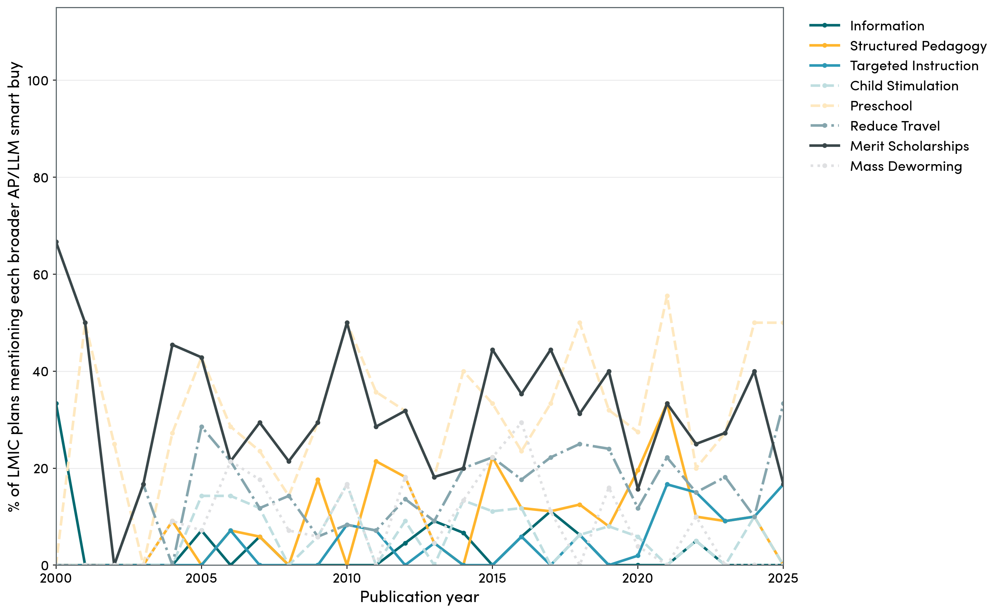

# Strict Smart Buy Mentions by Income Group

This chart shows how often national education plans mention each smart buy, split by high-income versus low- and middle-income countries, using a conservative search approach that we reviewed phrase by phrase. It is still designed to lean toward undercounting, but it is less restrictive than the earlier near-exact version and should better capture plausible references to the GEEAP/FCDO smart buys.

Phrases that produced zero matches across the corpus were removed from the active search code, so the lists below now show only reviewed terms that actually fire at least once.

The reviewed search terms used in this figure are:

- `Information`: `information on the quality of education`
- `Structured Pedagogy`: `structured pedagogy`, `structured lesson plans`, `ongoing teacher support`, `teacher mentoring`
- `Targeted Instruction`: `teaching at the right level`, `TaRL`, `targeted instruction`
- `Parent Stimulation`: `group sessions` within `400` characters of `stimulation`, `early childhood stimulation`, or `early stimulation`
- `Pre-Primary ECE`: `quality preschool`, `preschool quality`; plus `teacher training programs` within `400` characters of `preschool` or `preprimary`
- `Reduce Travel`: `providing transport`, `providing bicycles`, `school proximity`, `transport assistance`
- `Merit Scholarships`: `cash payments` within `400` characters of merit or scholarship terms, and `prizes` within `400` characters of `performance`
- `Mass Deworming`: `mass deworming`

**Strict smart buy mentions by income group.** This reviewed phrase search is the conservative lower-bound figure.

## Are These Mentions All Recent?

Not entirely. Under the current strict screen, the earliest hits appear in `2004` for `Mass Deworming`, `2005` for `Pre-Primary ECE`, `2007` for `Targeted Instruction`, `2008` for `Reduce Travel`, `2012` for `Structured Pedagogy`, `2013` for `Information`, `2018` for `Merit Scholarships`, and `2019` for `Parent Stimulation`.

The figure below shows the share of LMIC plans mentioning at least one strict smart buy by publication year. It is still noisy year to year, but it helps show that these mentions are not only a very recent phenomenon, even if they do become a bit more common in the most recent plans.

Most of the underlying research has been around for quite a while. DFID/FCDO appear to have begun using a broader "Smart Buys" approach by `2019`, and the public education-specific smart-buys framing arrived with GEEAP, which launched in `2020` and released its first report in October `2020`.

**Strict smart buy mentions over time.** Share of LMIC plans mentioning at least one strict smart buy by publication year.

## The Next Step: A Broader RAG Search

The strict search above is still designed as a conservative lower bound. The next step in the process is a broader retrieval-and-verification workflow that tries to capture plans which may not explicitly reference the smart buys by name, but are clearly using the same intervention ideas.

This broader step is not meant to replace the strict series. It is meant to sit on top of it. The strict search gives a defensible minimum. The RAG workflow is the broader layer that looks for near-equivalent descriptions of the same ideas.

The same workflow can also be summarised visually in the same way as the strict series. The figures below are now generated from the completed full-corpus RAG run across all `528` plans. They use only rows with completed RAG labels, so partial pilot files do not silently treat unprocessed documents as zeros.

**Broader AP/LLM smart buy mentions by income group.** This is the broader layer using the completed full-corpus RAG run across all `528` plans.

**Broader AP/LLM smart buy mentions over time.** Aggregate patterns stay fairly similar even after broadening the search.

The figure below breaks that broad over-time pattern into the individual smart buys. Each line shows the share of LMIC plans in a given publication year that mention that broader intervention idea.

**Broad AP/LLM smart buy trends by category.** Each line shows the share of LMIC plans in a given year that mention that broader intervention idea.

## The Method In Plain English

For each document, we split the text into smaller chunks. For each smart buy, we then search those chunks in two ways.

First, we use a weighted lexical search. This is based on a broad set of phrase families developed from earlier broad-search work and manual review. Stronger cues get more weight than weaker ones.

Second, we use semantic retrieval with embeddings. This lets us find chunks that are close in meaning to the intervention idea even when the exact wording is different.

We combine the best hits from those two retrieval steps, keep the surrounding chunks for context, and then send only those candidate passages to the LLM.

The LLM works in two stages:

- a cheaper model does the first pass
- a stronger model reviews positives and uncertain cases

The model is asked not just whether the text uses the canonical smart-buy label, but whether it describes the same intervention idea. It must ground that judgment in a verbatim quote from the retrieved text.

## Positive-Side Validation Check

Before scaling this broader method to the full corpus, I manually reviewed a positive-only validation sample from an `80`-document pilot.

This validation should be read as a precision check, not as full accuracy. It tells us how often the broader RAG hits look like real smart-buy mentions or very close intervention equivalents. It does not tell us recall.

In a few high-income-country cases, the smart-buy framing itself is not a perfect fit. Even so, when those cases were doing something close enough in intervention logic, I treated them as valid positives for this broader layer.

Across `57` reviewed positive predictions:

- `53` were judged valid positives
- `4` were judged false positives

That gives:

- positive-side precision: `93.0%`
- false-positive rate: `7.0%`

## Validation By Smart Buy

| Smart buy | Positive sample | Valid positives | False positives | Precision | False-positive rate |
|---|---:|---:|---:|---:|---:|
| Information (`bb_info`) | 4 | 4 | 0 | 100.0% | 0.0% |
| Structured pedagogy (`bb_structped`) | 7 | 7 | 0 | 100.0% | 0.0% |
| Targeted instruction / TaRL (`bb_targeted`) | 4 | 4 | 0 | 100.0% | 0.0% |
| Parent stimulation (`bb_parentstim`) | 3 | 3 | 0 | 100.0% | 0.0% |
| Pre-primary (`bb_preprimary`) | 12 | 9 | 3 | 75.0% | 25.0% |
| Reduce travel (`bb_travel`) | 10 | 10 | 0 | 100.0% | 0.0% |
| Merit scholarships (`bb_merit`) | 12 | 11 | 1 | 91.7% | 8.3% |
| Mass deworming (`bb_deworm`) | 5 | 5 | 0 | 100.0% | 0.0% |

## How To Read This

The broad RAG workflow looks strongest for:

- `Structured Pedagogy`
- `Targeted Instruction`
- `Parent Stimulation`
- `Reduce Travel`
- `Mass Deworming`

`Merit Scholarships` also looks strong.

The main category that still needs more caution is `Pre-Primary ECE`, where some broader positive hits were still too loose.

So the simplest way to think about the process is:

1. the strict search gives a lower bound of explicit mentions
2. the broader RAG layer tries to capture near-equivalent intervention ideas
3. the validation check suggests that this broader layer is reasonably precise overall, while some categories remain cleaner than others

## LMIC Documents With The Most Strict Smart Buys

There are no LMIC PDFs in this corpus that contain all of the current strict smart buys. In fact, none contain more than `3` of the `8` strict smart buys.

The best match is [Afghanistan Education Sector Transitional Framework (Afghanistan, 2022)](http://planipolis.iiep.unesco.org/en/2022/afghanistan-education-sector-transitional-framework), which hits `3` strict smart buys: `Structured Pedagogy`, `Targeted Instruction`, and `Reduce Travel`.

The next-best LMIC documents only hit `2` strict smart buys. Two useful examples are [Education strategic plan 2024-2028 (Cambodia, 2025)](http://planipolis.iiep.unesco.org/en/2024/education-strategic-plan-2024-2028), which hits `Structured Pedagogy` and `Targeted Instruction`, and [School education sector plan 2022/23-2031/32 (Nepal, 2022)](http://planipolis.iiep.unesco.org/en/2022/school-education-sector-plan-202223-203132-7469), which also hits `Structured Pedagogy` and `Targeted Instruction`.
