# Smart Buys: Structured Pedagogy and Mentions

## Sample Flow (From `0.35 Summary Statistics.do`)

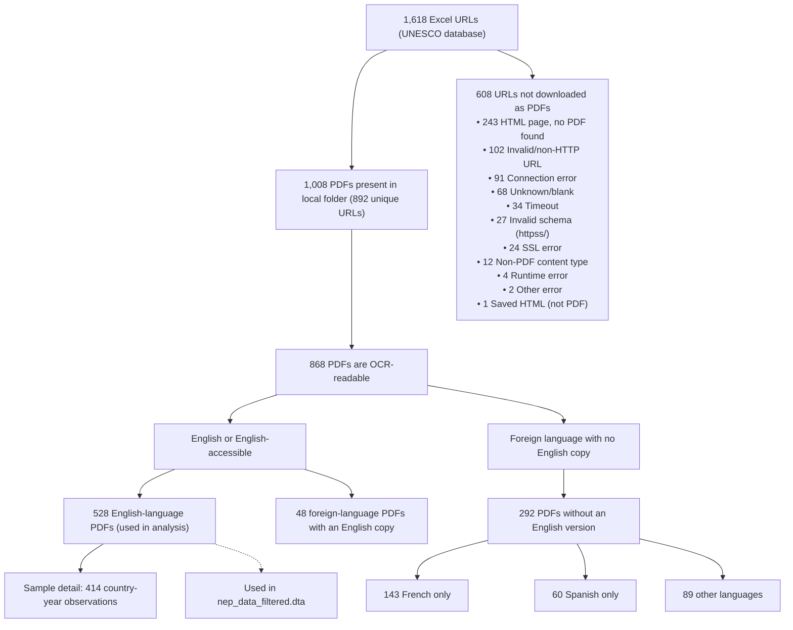

## Structured Pedagogy Figures (Smart Buys)

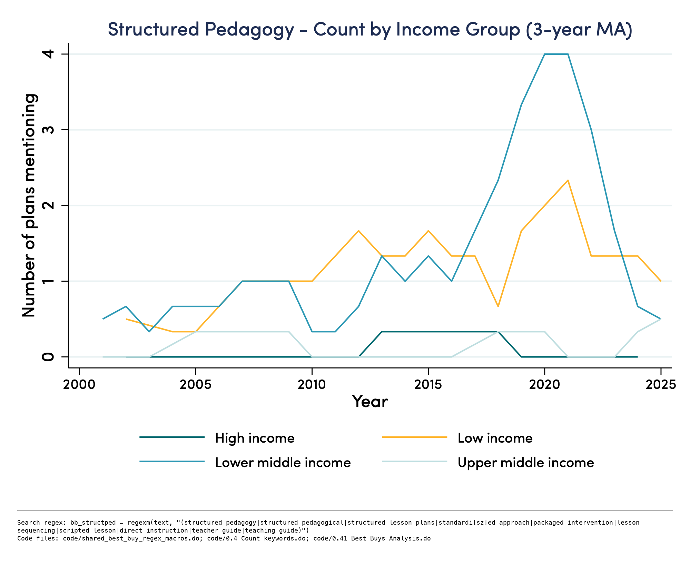

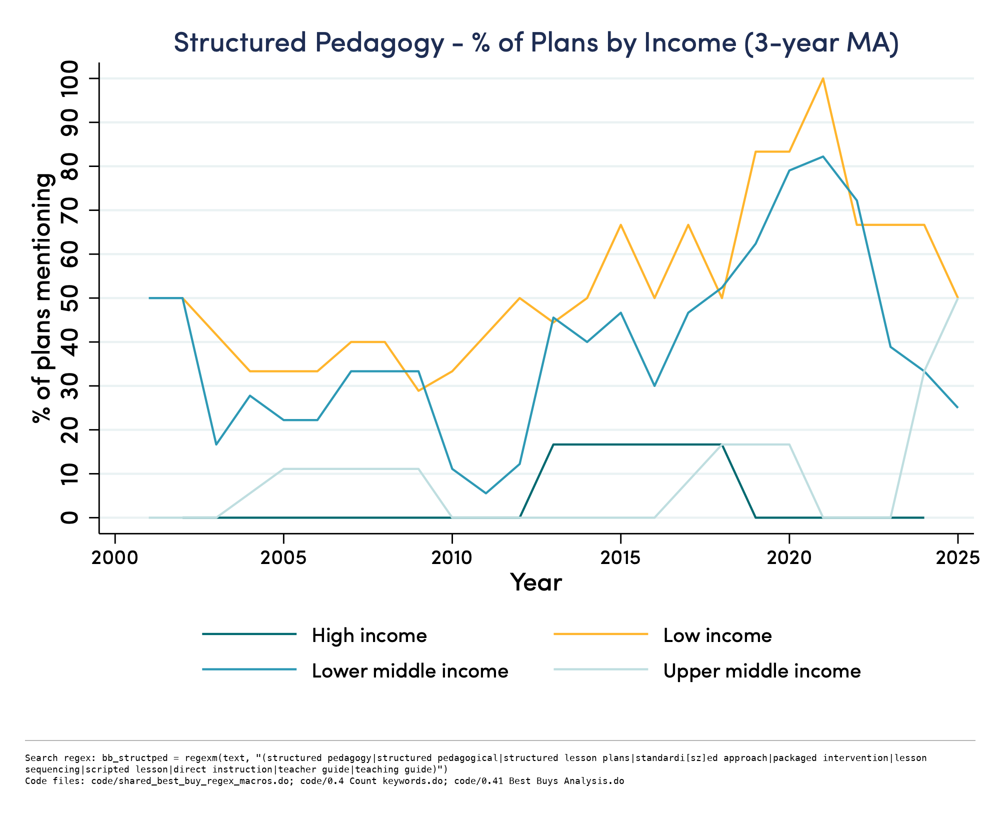

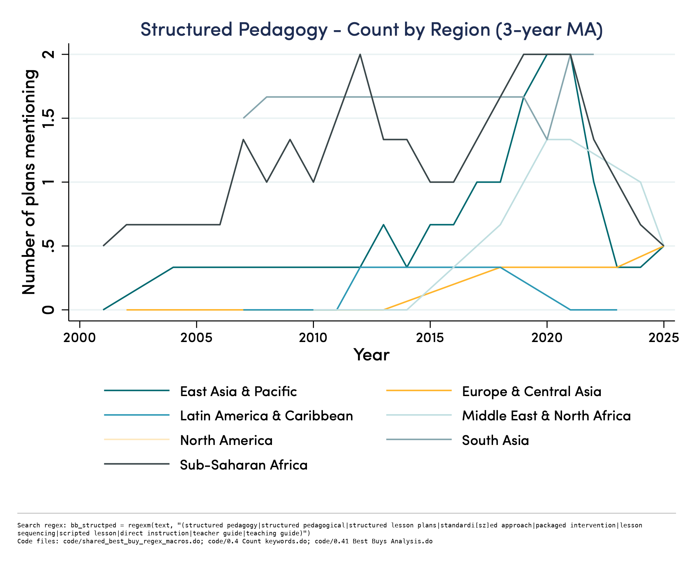

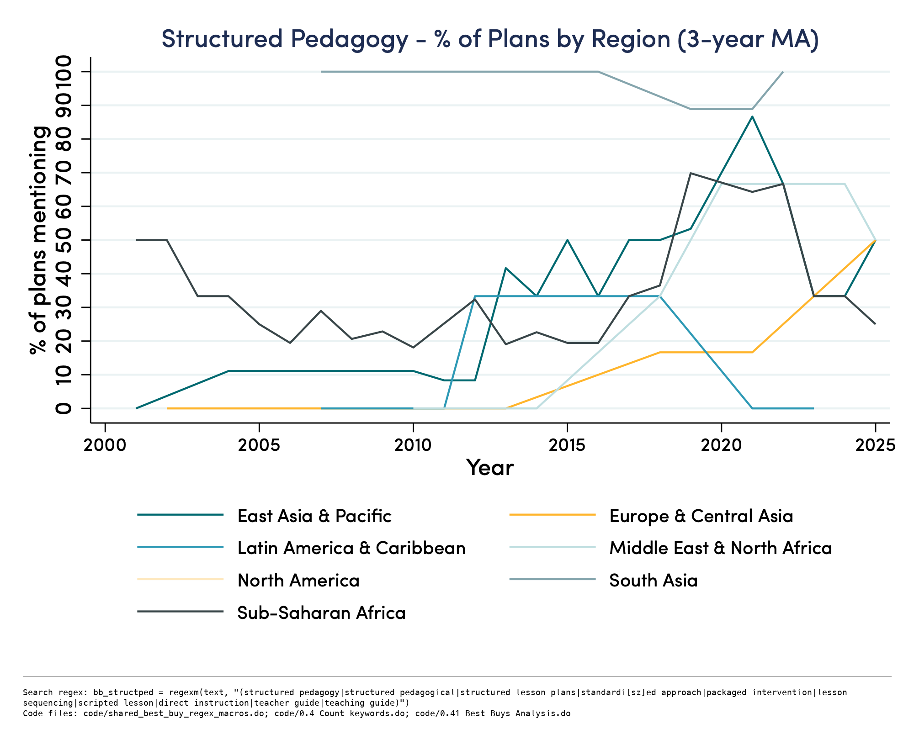

## TaRL Figures

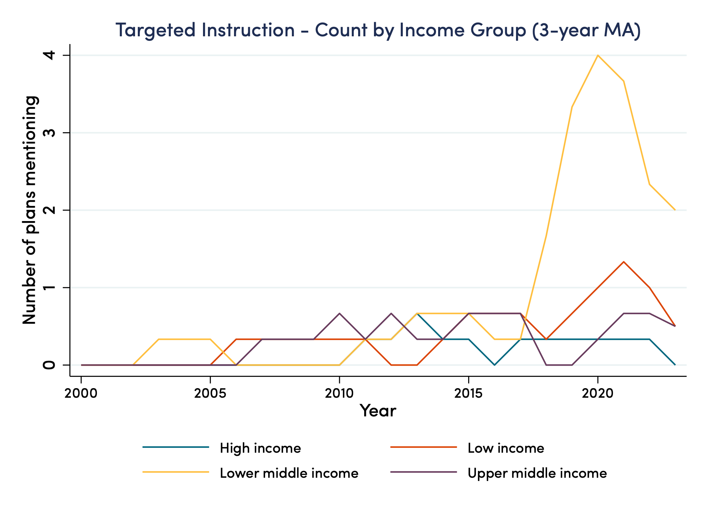

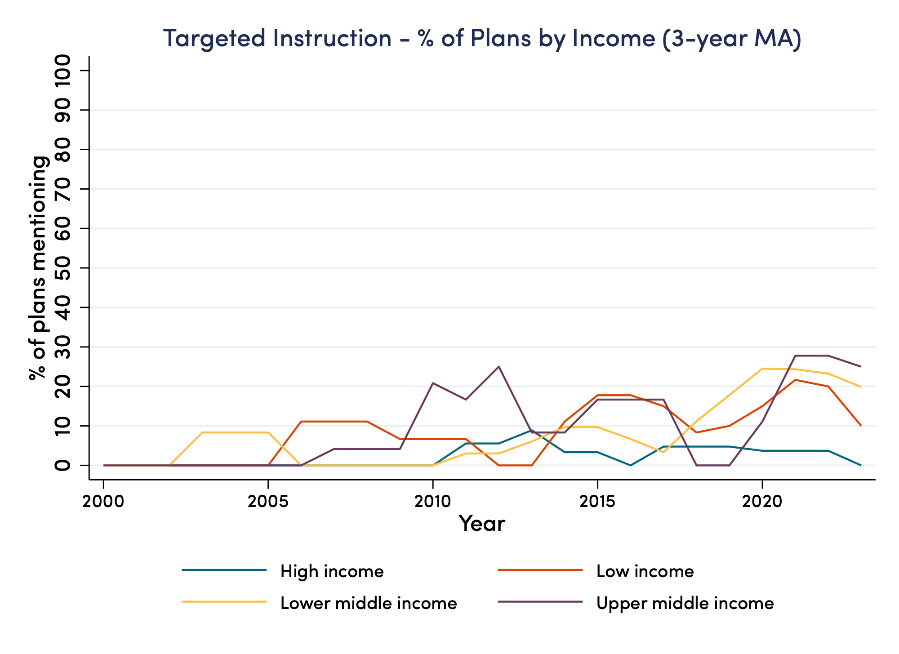

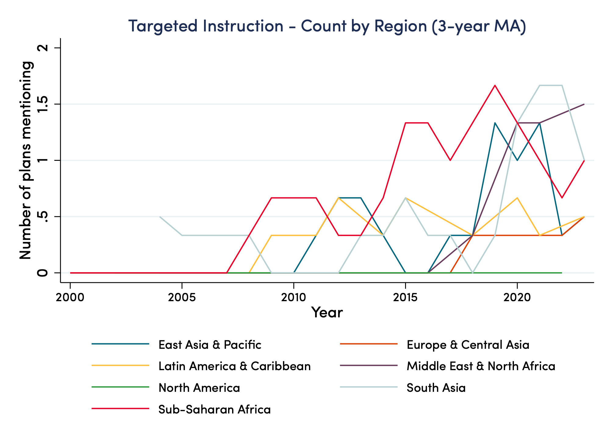

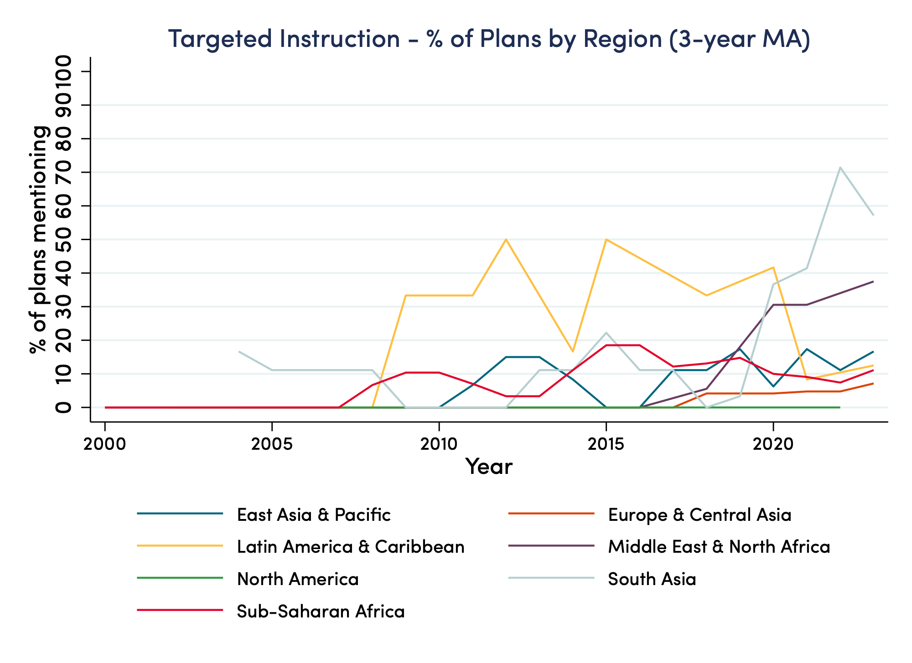

## Mention Graphs

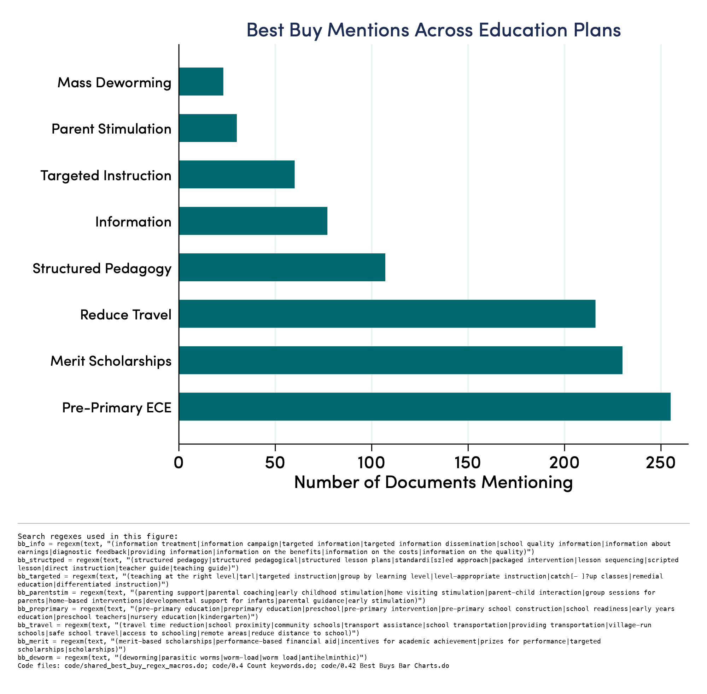

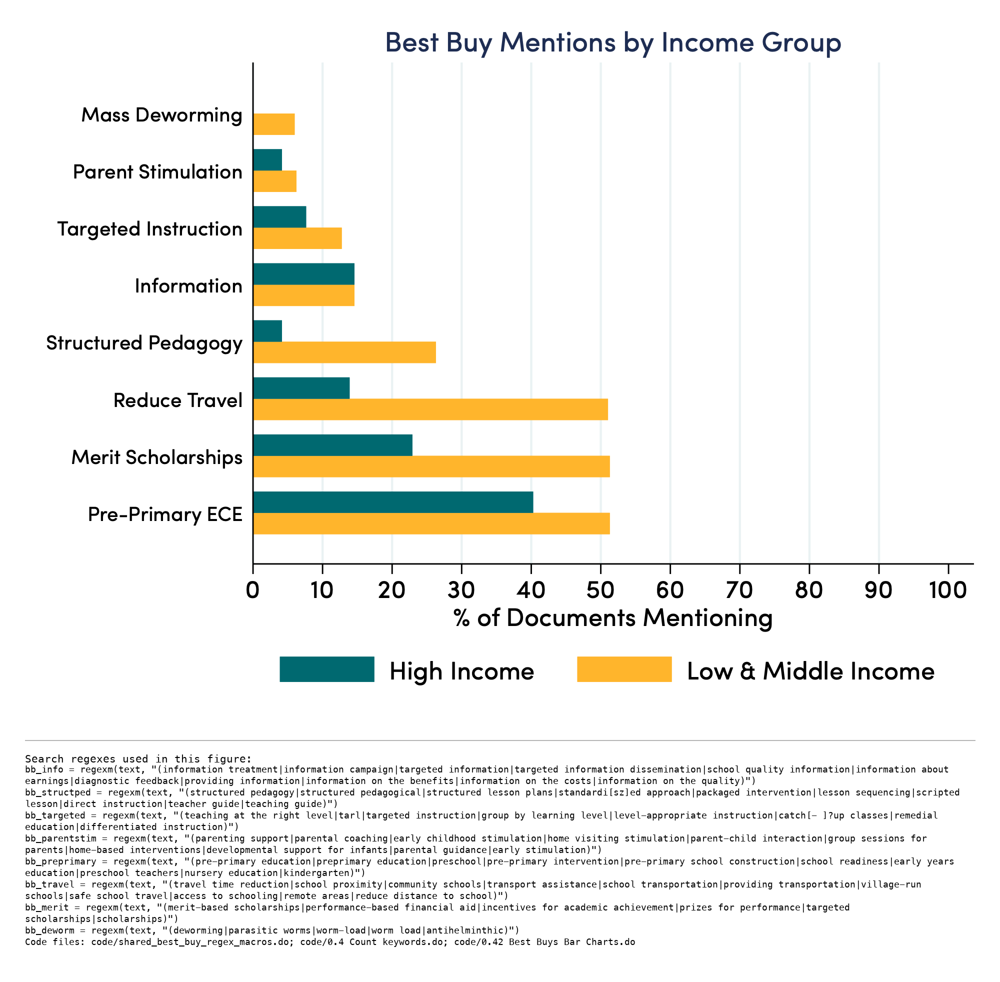
